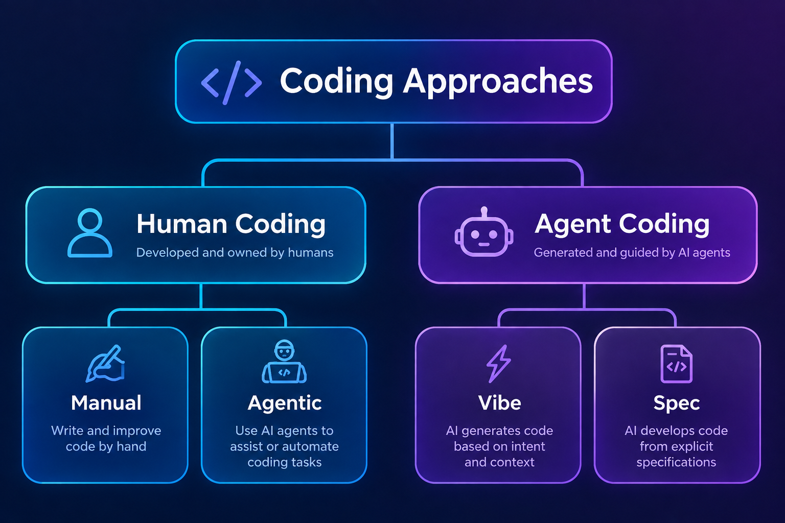

# Spec-Coding: Authority-Driven & Clarified Development

Welcome to the **Spec-Coding** practice repository! This project serves as an introductory guide, blueprint, and template for implementing **Spec-Coding**—a structured development methodology optimized for both human engineers and AI agents.

By establishing clear boundaries between specifications, step-by-step guidance, and repository metadata, Spec-Coding maximizes development speed, prevents architectural drift, and ensures unparalleled consistency in AI-assisted code generation.

---

## Architectural Concept



In Spec-Coding, development flows unidirectionally from the specification to implementation, guided by clarifications:

```text
       ┌────────────────────────┐
       │      Source/Specs      │ ◄── [Authoritative Truth]
       └───────────┬────────────┘
                   │
                   │ defines the desired result
                   ▼
       ┌────────────────────────┐
       │      Source/Clars      │ ◄── [Step-by-Step Guidance]
       └───────────┬────────────┘
                   │
                   │ defines how to develop toward that result
                   ▼
       ┌────────────────────────┐
       │     Implementation     │ ◄── [Executable Code]
       └────────────────────────┘
```

---

## Repository Layout

A typical Spec-Coding repository is organized with an explicit separation of specification, development step clarifications, and executable code:

```text
├── README.md               # Repository introduction and overview (this file)
├── GEMINI.md               # Repository handbook (Specifications, Clarifications, Metadata rules)
├── coding.png              # Architectural diagram of the practice
└── Source/                 # The primary workspace for development
    ├── Specs/              # Authoritative source of truth (Specifications)
    ├── Clars/              # Implementation sequence and detail guides (Clarifications)
    │   ├── Index.md        # Entry point and index for all clarifications
    │   ├── 1-Code organization/
    │   ├── 2-UI code organization/
    │   └── ...
    └── [App Code]          # Actual source code files (e.g., components, backend, etc.)
```

---

## Core Principles

### 1. Specification Authority (`Source/Specs/`)
The specification layer is the **highest priority artifact** in the codebase.
* **The Truth:** Every line of code, design asset, and configuration under `Source/` must conform to the models and constraints defined under `Source/Specs/`.
* **Zero Contradictions:** Generated code or transient artifacts can never redefine or override specifications.
* **No Accommodation Edits:** Never modify a spec to match or justify a convenient implementation. If a spec needs to change, it must be updated intentionally through an explicit specification-change process first, after which the implementation is updated or regenerated to align.

*For more details, see the complete [Specification Rules](./GEMINI.md#specification).*

---

### 2. Clarification Sequencing (`Source/Clars/`)
While specifications define **what the system should be**, clarifications define **how to develop toward that result**.
* **Step-by-Step Guidance:** Clarifications translate complex specifications into sequenced implementation instructions, code samples, and concrete local configurations.
* **Dependency & Order:** Clarification directories use an ordering prefix (e.g., `1-Code organization`, `2-UI code organization`). Lower-order clarifications are completed first, establishing dependencies that higher-order steps can safely rely upon.
* **No New Requirements:** Clarifications must never introduce goals or requirements that are not derived from the specifications.

*For more details, see the complete [Clarification Rules](./GEMINI.md#clarification).*

---

### 3. Metadata Layer (Knowledge, Memory, & Navigation)
Spec-Coding integrates a lightweight, in-place metadata layer that resides alongside primary files to help AI agents and human contributors efficiently navigate and understand the workspace.

```text
.navigation/    # Answers: "Where should I look?"
    └── Index.md
.knowledge/     # Answers: "How does this work?"
    └── Index.md
.memory/        # Answers: "What have previous agents learned?"
    └── Index.md
```

* **Independent & Non-intrusive:** The metadata layer supplements the code but is never imported or referenced by the primary source code.
* **Prevents Broad Scans:** Agents use `.navigation/Index.md` to pinpoint specific code files instead of performing expensive full-workspace scans.
* **Long-Term Preservation:** `.memory` captures operational pitfalls, debugging breakthroughs, and setup quirks that keep future agents from repeating past mistakes.

*For more details, see the complete [Metadata Layer Guide](./GEMINI.md#in-place-knowledge-and-memory).*

---

## The Spec-Coding Workflow

Whether you are a developer or an AI agent, you should interact with this repository using the following workflow:

```text
   ┌─────────────────────────────────────────────────────────┐
   │ 1. RESEARCH & DISCOVER                                  │
   │    Identify nearest metadata layer (.navigation/Index)  │
   │    to locate specifications and relevant code.          │
   └────────────────────────────┬────────────────────────────┘
                                │
                                ▼
   ┌─────────────────────────────────────────────────────────┐
   │ 2. CONSULT SPECIFICATIONS                               │
   │    Read the authoritative model in Source/Specs/.       │
   └────────────────────────────┬────────────────────────────┘
                                │
                                ▼
   ┌─────────────────────────────────────────────────────────┐
   │ 3. ALIGN WITH CLARIFICATIONS                            │
   │    Consult Source/Clars/ for step-by-step instructions  │
   │    following the defined Order Index (<Order>-<Name>).  │
   └────────────────────────────┬────────────────────────────┘
                                │
                                ▼
   ┌─────────────────────────────────────────────────────────┐
   │ 4. EXECUTE & VALIDATE                                   │
   │    Generate/write code. Verify output does not          │
   │    contradict Specs/ or introduce hidden assumptions.   │
   └────────────────────────────┬────────────────────────────┘
                                │
                                ▼
   ┌─────────────────────────────────────────────────────────┐
   │ 5. UPDATE METADATA                                      │
   │    Record lessons learned in .memory/ if any major      │
   │    pitfalls or system insights were discovered.         │
   └─────────────────────────────────────────────────────────┘
```

---

## Contributing & Best Practices

1. **Specs Over Code:** If a pull request modifies source code in a way that diverges from `Source/Specs/`, either update the PR to match the specification, or explicitly propose a Specification Update PR first.
2. **Keep Clarifications Modular:** Write focused clarification guides. Start clarification names with sequential indices so that dependencies are obvious.
3. **Respect Metadata Scope:** Keep metadata folders local to the specific modules they describe. Do not let `.navigation` or `.knowledge` grow into massive monolithic files.

Let's build reliable, deterministic, and highly explainable software using **Spec-Coding**!
